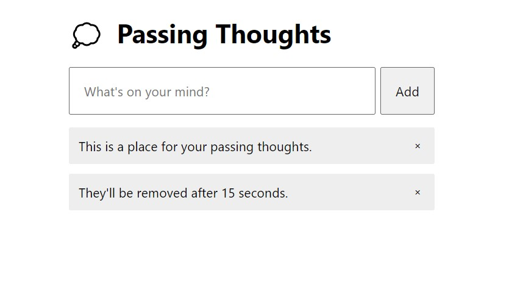

# Passing Thoughts(Testing)

## Table of contents

- [Overview](#overview)
  - [The challenge](#the-challenge)
  - [Screenshot](#screenshot)
  - [Links](#links)
- [My process](#my-process)
  - [Built with](#built-with)
  - [What I learned](#what-i-learned)
  - [Continued development](#continued-development)
- [Author](#author)

## Overview

### The challenge

Users should be able to:

- View the optimal layout for the app depending on their device's screen size
- Enter a thought in the input.
- Thought is added below.
- Thought is deleted in 15 seconds.
- In Node.js, run `npm test` and see the test pass.

### Screenshot

### Links

- Live Site URL: [View](https://passingthoughtstesting.netlify.app/)

## My process

- React Testing Library allows us to test React components by mimicking real user interactions.
- In order to make your component available in the unit test, we have to use the `render()` function. We can check to see the available components in our rendered DOM by using the `screen.debug()` method. `screen` is a special object that can be thought of as a representation of the browser window.
- RTL has built-in query methods (`.getByX`,`.findByX`,`.queryByX`) that allow us to extract the DOM nodes from your components. We can use these query methods by using the `screen` object, e.g., `screen.getByText()`.
- We can test the behavior of these extracted nodes by using the jest matchers provided by the `@testing-library/jest-dom` library. E.g. `expect().toBeChecked()`.
- We can mimic user interactions by using methods provided by the `testing-library/user-event` library. An example method is `userEvent.click()`.
- Besides `.findByX`, RTL has the `waitFor()` asynchronous function that can be used to test asynchronous events such as an element being removed asynchronously or a component making an API call.
- We can test with accessibility in mind by using `ByRole` query variants to help us discover accessibility holes in our applications.

### Built with

- Semantic HTML5 markup
- CSS custom properties
- Mobile-Responsive Design
- JavaScript - Scripting language
- [React](https://reactjs.org/) - JS library

### What I learned

This was a class project to learn about react testing library.

### Continued development

maybe use later

## Author

- Website - [Cameron Howze](https://camkol.github.io/)
- Frontend Mentor - [@camkol](https://www.frontendmentor.io/profile/camkol)
- GitHub- [@camkol](https://github.com/camkol)
- LinkedIn - [@cameron-howze](https://www.linkedin.com/in/cameron-howze-28a646109/)
- E-Mail - [cameronhowze4@outlook.com](mailto:cameronhowze4@outlook.com)
